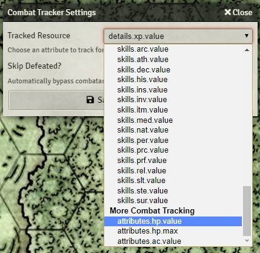

# More Combat Tracking

More Combat Tracking is a Foundry VTT module that lets you track additional resources in the combat tracker settings.

## Installation

Install using the URL : ``

## Supported Systems

- D&D 5e
- Pathfinder 2e

## Usage

## License

This Foundry VTT module, written by falclif, is licensed under a [Creative Commons Attribution 4.0 International License](http://creativecommons.org/licenses/by/4.0/).

This work is licensed under Foundry Virtual Tabletop [EULA - Limited License Agreement for module development v 0.1.6](http://foundryvtt.com/pages/license.html).
